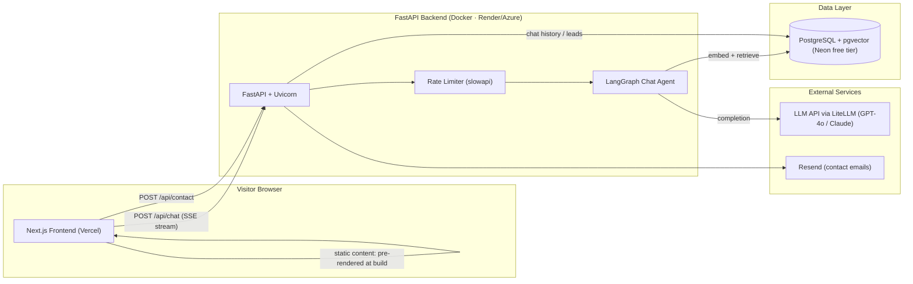

# Portfolio Website — Architecture

**Owner:** Akshay Goswami · AI/ML Engineer
**Goal:** A fast, SEO-friendly portfolio that doesn't just *list* AI skills — it *demonstrates* them with a built-in RAG chatbot ("Ask Akshay") that answers recruiter questions about your experience, grounded in your resume and project write-ups. This mirrors the Lexee/Lexvia work you shipped professionally, so the site itself is proof of skill.

---

## 1. High-Level Overview



**Key principle — static-first, AI-enhanced:** All portfolio content (projects, experience, skills) is content-as-code in the frontend repo, pre-rendered at build time. The backend powers only *dynamic* features (chat, contact form). If the free-tier backend cold-starts or is down, the site still works perfectly — the chat widget just shows "waking up…" and retries.

---

## 2. Repository Layout (monorepo)

```
d:\Portfolio
├── web/                      # Frontend — Next.js (deployed to Vercel)
│   ├── app/                  # App Router pages
│   │   ├── page.tsx          # Home (hero, highlights, featured projects)
│   │   ├── projects/
│   │   │   ├── page.tsx      # Project index
│   │   │   └── [slug]/page.tsx  # Case-study pages (MDX)
│   │   ├── about/page.tsx
│   │   └── api/              # (none — all API lives in FastAPI)
│   ├── components/
│   │   ├── chat/             # AskAkshay floating chat widget (SSE client)
│   │   ├── sections/         # Hero, Experience, Skills, Education, Contact
│   │   └── ui/               # shadcn/ui primitives
│   ├── content/              # MDX case studies + structured data
│   │   ├── projects/         # amicus.mdx, lexvia-ui.mdx, lexvia-backend.mdx, lexee.mdx
│   │   ├── experience.json
│   │   └── skills.json
│   └── lib/
├── api/                      # Backend — FastAPI (Dockerized)
│   ├── app/
│   │   ├── main.py           # FastAPI app, CORS, middleware
│   │   ├── routers/
│   │   │   ├── chat.py       # POST /chat (SSE streaming)
│   │   │   └── contact.py    # POST /contact
│   │   ├── agent/
│   │   │   ├── graph.py      # LangGraph state graph
│   │   │   ├── retriever.py  # pgvector similarity search
│   │   │   └── prompts.py    # versioned system prompts
│   │   ├── models/           # SQLAlchemy models
│   │   ├── schemas/          # Pydantic request/response schemas
│   │   └── core/             # config, db session, rate limiting, logging
│   ├── alembic/              # migrations
│   ├── scripts/
│   │   └── ingest.py         # chunk + embed resume/content → pgvector
│   ├── Dockerfile
│   └── pyproject.toml        # uv-managed
├── .github/workflows/        # CI: lint + typecheck + deploy triggers
└── ARCHITECTURE.md
```

---

## 3. Frontend (`web/`)

| Concern | Choice | Why |
|---|---|---|
| Framework | **Next.js 15 (App Router) + TypeScript** | SSG for SEO (recruiters find you via Google), and it's the industry-standard React meta-framework — good signal on your resume alongside your React 18 experience |
| Styling | **Tailwind CSS + shadcn/ui** | Fast to build, consistent design system, dark mode built in |
| Animation | **Framer Motion** | Subtle scroll/hover polish without weight |
| Content | **MDX + JSON in `content/`** | Projects are version-controlled case studies; no CMS to maintain |
| Hosting | **Vercel (free tier)** | Zero-config Next.js deploys, preview URLs per PR, custom domain |

### Pages & sections

1. **Home** — Hero ("AI/ML Engineer — I ship production agentic systems"), impact metrics pulled straight from your resume (~85% sync-latency cut, 5k+ docs/day, ~40% lead-capture lift), featured projects, CTA to chat widget.
2. **Projects index + case studies** — one MDX page per project (Amicus, Lexvia UI, Lexvia Backend, Lexee) with a Problem → Architecture → Impact structure and a small architecture diagram each. This is where you stand out: most portfolios list tech; yours explains system design.
3. **About** — background, C-DAC PG Diploma, the full-stack → AI story.
4. **Contact** — form posting to the backend, plus direct email/LinkedIn links.
5. **AskAkshay chat widget** — floating button on every page. Streams responses over SSE from the backend. First-load message suggests questions ("What did Akshay build at CloudLex?", "Does he have RAG experience?").

### Frontend–backend contract

- `POST {API_URL}/chat` — `{ session_id, message }` → SSE stream of tokens.
- `POST {API_URL}/contact` — `{ name, email, message }` → `202 Accepted`.
- API base URL from `NEXT_PUBLIC_API_URL`; widget handles cold-start latency gracefully (loading state + one retry).

---

## 4. Backend (`api/`)

| Concern | Choice | Why |
|---|---|---|
| Framework | **FastAPI + Uvicorn (Python 3.12, uv)** | Your professional core stack — the repo doubles as a code sample |
| Agent | **LangGraph** single-node → expandable graph | Same tooling as Amicus/Lexee; checkpointing in Postgres if you later want multi-turn memory |
| LLM access | **LiteLLM** | Provider-agnostic (start on a cheap model, swap freely), mirrors your ChatLiteLLM experience |
| DB | **PostgreSQL + pgvector (Neon free tier)** | One free database for embeddings, chat logs, and contact leads; SQLAlchemy + Alembic like your day job |
| Email | **Resend** (free tier) | Contact-form notifications to your inbox |
| Rate limiting | **slowapi** (IP-based) | Public LLM endpoint must be abuse-proof — this protects your API bill |
| Hosting | **Docker on Render free tier** (or Azure Container Apps if you want the Azure story) | Containerized like your production services |

### Endpoints

| Method | Path | Purpose |
|---|---|---|
| `POST` | `/chat` | RAG chat; streams tokens via SSE; logs Q&A per session |
| `POST` | `/contact` | Validates, stores lead in Postgres, emails you via Resend |
| `GET` | `/health` | Uptime checks + frontend "is the backend awake" ping |

### RAG pipeline ("Ask Akshay")

1. **Ingestion (offline, `scripts/ingest.py`)** — chunk resume + project MDX + an extended "facts about Akshay" doc → embed (small embedding model) → upsert into pgvector. Re-run on content changes (CI step).
2. **Query time** — LangGraph flow: `retrieve (top-k pgvector) → guard (only answer about Akshay; deflect off-topic/prompt-injection) → generate (grounded answer with a friendly recruiter-facing tone) → log`.
3. **Cost control** — hard cap on tokens per response, per-IP daily message quota, and a monthly LLM budget alarm. The corpus is tiny, so retrieval is cheap; the LLM call is the only real cost (a few dollars/month at portfolio traffic).

### Security

- CORS locked to your domain(s).
- Rate limiting on both endpoints; honeypot field + server-side validation on contact form.
- Prompt-injection hardening: system prompt treats retrieved chunks as data, refuses instructions from user input, never reveals the prompt.
- Secrets via environment variables only (Render/Azure secret store); nothing in the repo.

---

## 5. CI/CD

- **GitHub repo (monorepo)** — pushing `main` triggers:
  - **web/** → Vercel auto-deploy (with PR preview URLs).
  - **api/** → GitHub Action: lint (ruff) + typecheck + build Docker image → deploy to Render/Azure; run `alembic upgrade` + re-ingest embeddings if content changed.
- Branch protection + PR previews give you a professional workflow to point at in interviews.

---

## 6. Build Order (phased)

| Phase | Scope | Outcome |
|---|---|---|
| **1 — Static MVP** | Next.js site with all sections + MDX case studies, deployed to Vercel with custom domain | Shareable portfolio in days; SEO indexing starts |
| **2 — Backend + Contact** | FastAPI + Postgres + Resend contact form, Dockerized, deployed | Full-stack skeleton live |
| **3 — AskAkshay RAG chat** | Ingestion script, LangGraph agent, SSE streaming widget, rate limits | The differentiator — a live agentic AI demo |
| **4 — Polish** | Analytics (Plausible/Umami), OG images, Lighthouse ≥95, resume-download tracking, blog (optional) | Recruiter-ready |

---

## 7. Estimated Running Cost

| Item | Cost |
|---|---|
| Vercel, Neon, Render free tiers | $0 |
| Domain (e.g. akshaygoswami.dev) | ~$10–15/yr |
| LLM API usage (capped) | ~$1–5/mo |
